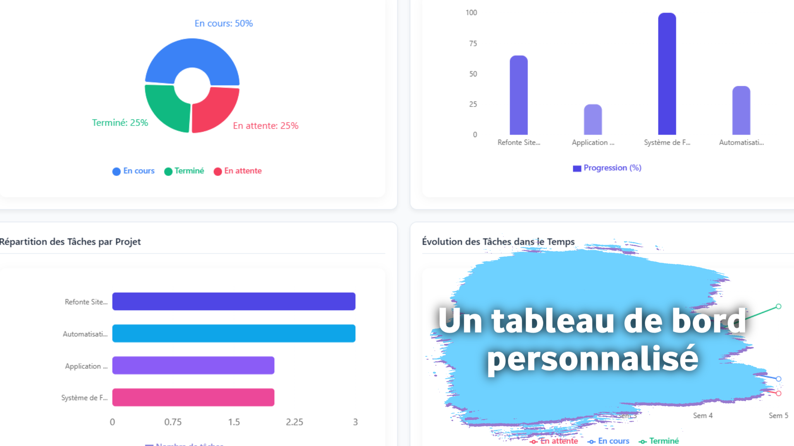
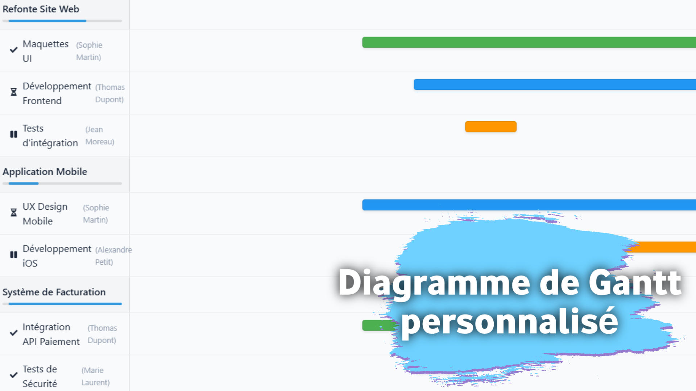
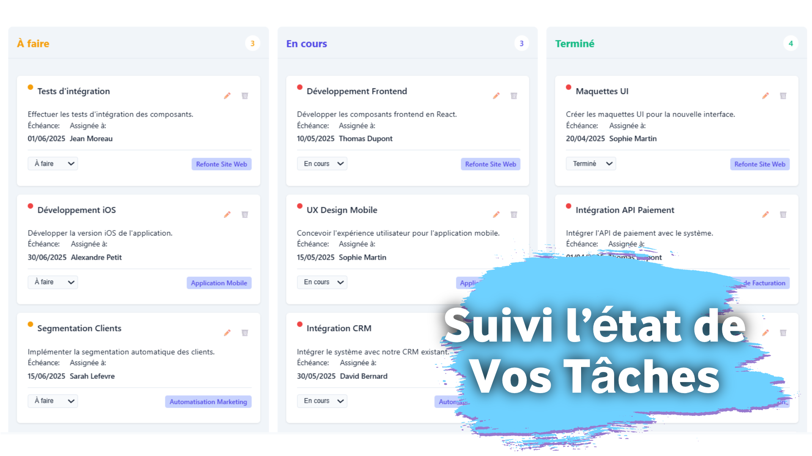

# Taskaura — Frontend (React + Vite)

Taskaura is a web application for project and task management with a dashboard, calendar, Gantt chart, notifications, and exports (PDF). The UI is designed for multiple roles (Administrator, Manager, Employee) and relies on a backend API (Laravel, `/api/*` endpoints) for authentication and data.

## Quick Overview

- Framework: React 19 + Vite 6
- UI: React components + CSS (global + per-component CSS)
- Auth: Bearer token stored locally (`localStorage`) + Sanctum compatibility (CSRF cookie)
- Navigation: state-driven SPA (no react-router), controlled by `activeMenu`
- Expected API: `http://localhost:8000/api` (current configuration)

## Screenshots (Demo)

The images used in the landing page carousel are available here:

- 
- 
- 
- 
- 
- 

## Demo Video


https://github.com/user-attachments/assets/5e517367-d78e-42e8-ab75-2ea68d0e52db


### Authentication & Roles

- Landing (“marketing”) page + demo carousel
- Login / forgot password flow
- Local storage:
  - `auth_token`: Bearer token
  - `user_data`: user info (role, identity, etc.)
- UI roles (labels):
  - `admin` → Administrator
  - `manager` → Manager
  - `user` → Employee

### Projects & Tasks

- Projects: list, filters (status), search, sort, create / edit / delete
- Tasks: create / edit / delete, status updates, manager and employee views
- Employee assignment (via the API)

### Monitoring & Visualization

- Dashboard:
  - statistics cards
  - charts (Recharts)
- Gantt chart (visualization)
- Calendar (manager and employee)

### Notifications

- Notification center (unread, count, mark as read, delete)

### Exports

- PDF export (blob) from the API:
  - all projects
  - projects + employees
  - a specific project

### Profile & Theme

- User profile (edit + image upload through the API)
- Light / dark theme via the `data-theme` attribute and `localStorage`

## Tech Stack

Main dependencies (see `package.json`):

- React, React DOM
- Vite + React SWC plugin
- axios (API)
- recharts (charts)
- react-gantt (Gantt)
- jspdf + jspdf-autotable (client-side exports if needed)
- xlsx (spreadsheet exports)
- react-icons

## Project Structure

Simplified tree:

- `public/` static assets (favicon, demo screenshots)
- `src/`
  - `App.jsx` main entry for auth, layout, sidebar, navigation, pages
  - `main.jsx` React bootstrap
  - `axios.js` axios instance (baseURL, Bearer token, Sanctum CSRF)
  - `services/` API calls (auth, projects, tasks, notifications, export…)
  - `components/` UI components by domain (auth, projects, tasks, calendar…)
  - `data/mockData.js` demo data (used to initialize some local states)
  - `*.css` global styles

## Requirements

- Node.js (a recent version is recommended, compatible with Vite 6)
- npm (or equivalent)
- A backend API available (by default):
  - API: `http://localhost:8000/api`
  - CSRF cookie (Sanctum): `http://localhost:8000/sanctum/csrf-cookie`

Without a backend, some UI may still render, but most “business” screens perform network calls and depend on the API.

## Installation

```bash
npm install
```

## Configuration (API)

The current configuration is hard-coded in `src/axios.js`:

- `API_BASE_URL = 'http://localhost:8000/api'`

If your backend runs elsewhere (different port/domain), update this value.

Important notes for Laravel Sanctum:

- enable CORS for the frontend origin (e.g. `http://localhost:5173`)
- allow cookies / credentials (`withCredentials: true` is enabled in the frontend)
- ensure `/sanctum/csrf-cookie` works correctly

## Run the App (Development)

```bash
npm run dev
```

Vite usually starts at:

- http://localhost:5173

## Build & Preview (Production)

Build:

```bash
npm run build
```

Preview the build:

```bash
npm run preview
```

## Lint

```bash
npm run lint
```

## API Endpoints Used (Reference)

This list helps clarify what the frontend expects from the backend (non-exhaustive).

Auth:

- `POST /login`
- `POST /logout`
- `GET /user`
- `PUT /profile`
- `POST /forgot-password`
- `POST /verify-reset-code`
- `POST /reset-password`
- `GET /sanctum/csrf-cookie` (outside `/api`, Sanctum)

Projects:

- `GET /projects`
- `GET /projects/:id`
- `POST /projects`
- `PUT /projects/:id`
- `DELETE /projects/:id`
- `GET /assign-user` (list of assignable employees)

Tasks:

- `GET /projects/:projectId/tasks`
- `POST /projects/:projectId/tasks`
- `PUT /projects/:projectId/tasks/:taskId`
- `DELETE /projects/:projectId/tasks/:taskId`
- `GET /manager/tasks`
- `GET /employee/tasks`

Notifications:

- `GET /notifications`
- `GET /notifications/unread`
- `GET /notifications/count`
- `PUT /notifications/:id/read`
- `PUT /notifications/read-all`
- `DELETE /notifications/:id`
- `DELETE /notifications`

Exports:

- `GET /export/projects/pdf`
- `GET /export/projects-with-users`
- `GET /export/projects/:projectId/pdf`

## Usage (Typical Flow)

1. Open the application (landing page + carousel)
2. Log in
3. Depending on the role:
   - Manager: Dashboard, Projects, Tasks, Gantt, Manager Calendar, Export
   - Employee: Employee dashboard, My Projects, My Tasks, Employee Calendar
   - Admin: administration screens (employees list, managers, etc.)
4. Use the notification center and update your profile

## Troubleshooting

- 401 (unauthorized): expired/invalid token → log in again (the frontend clears `auth_token`)
- 419 (CSRF): check Sanctum + cookies + CORS + `withCredentials`
- CORS browser block: allow the frontend origin in the backend CORS config
- Wrong API URL: update `src/axios.js` (baseURL)


